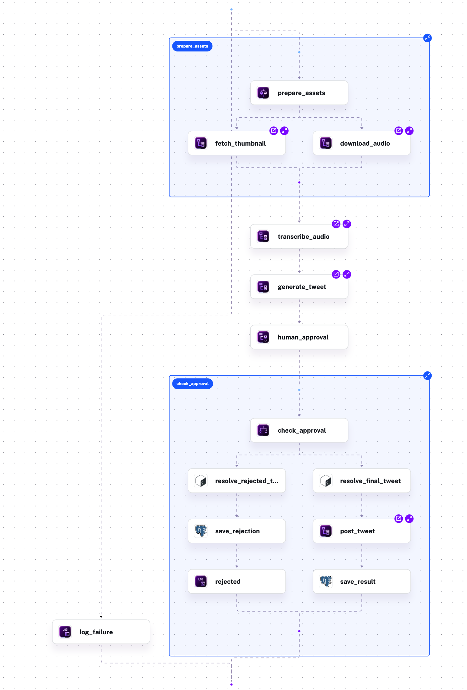
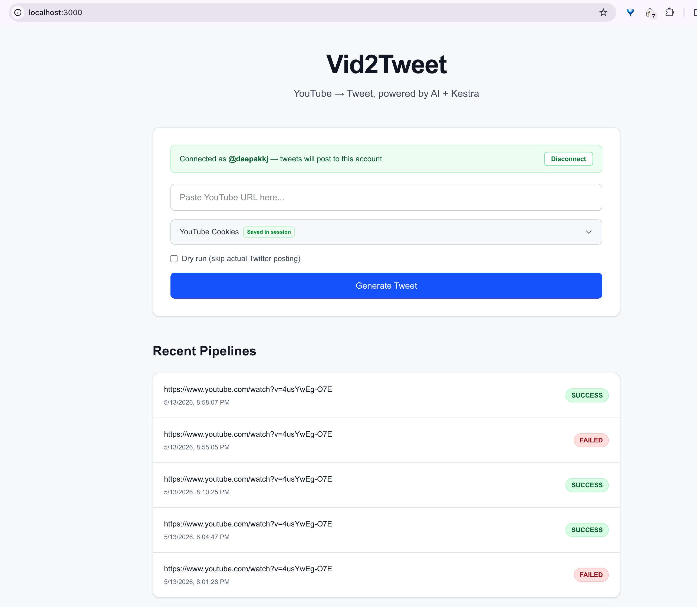
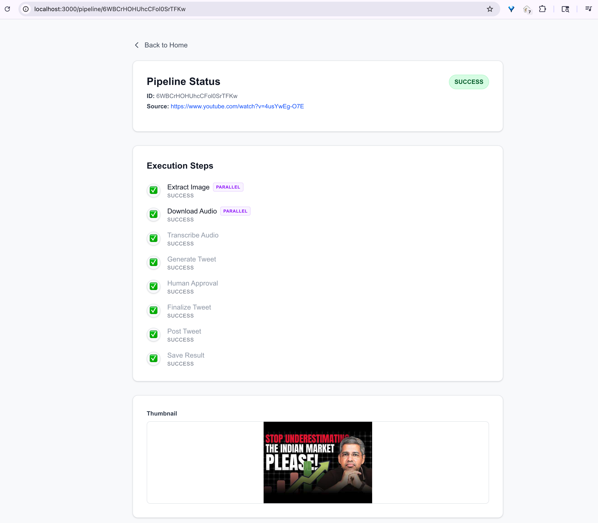

# Vid2Tweet — YouTube to Tweet AI Pipeline

> Transform a YouTube video into a reviewable tweet with Kestra orchestration, Groq models, human approval, and flexible X posting modes.

## Table of Contents

- [What It Does](#what-it-does)
- [Current Flow](#current-flow)
- [Screenshots](#screenshots)
- [Tech Stack](#tech-stack)
- [Posting Modes](#posting-modes)
- [Prerequisites](#prerequisites)
- [Quick Start](#quick-start)
- [Manual Flow Deployment Order](#manual-flow-deployment-order)
- [How To Use The App](#how-to-use-the-app)
- [Operational Notes](#operational-notes)
- [Security Note](#security-note)
- [Documentation](#documentation)
- [AI Models Used](docs/FLOWS.md#ai-models-used)
- [License](#license)

## What It Does

Vid2Tweet turns a single YouTube URL into a tweet draft and approval workflow:

1. Downloads and compresses video audio
2. Fetches the YouTube thumbnail
3. Transcribes audio with Groq Whisper
4. Generates a tweet with Groq Llama 3.3
5. Pauses for human review and optional editing
6. Posts to X or saves a dry-run result
7. Stores the outcome in PostgreSQL

The app still uses Kestra as the workflow engine, but the frontend also includes a small set of Next.js server routes for OAuth handshakes and safe token forwarding during pipeline trigger.

## Current Flow

```text
YouTube URL + cookies
        │
        ▼
Frontend (Next.js)
        │  trigger / poll / resume
        ▼
Kestra content-pipeline
   ├─ extract-image
   ├─ download-audio
   ├─ transcribe-audio
   ├─ generate-tweet
   ├─ human approval pause
   └─ post-tweet + save result
        │
        ├─ Groq API
        ├─ X API
        └─ PostgreSQL
```

## Screenshots

### Kestra Topology flow for Vid2Tweet




### Home screen




### Approval screen




## Tech Stack

| Component | Technology |
|-----------|-----------|
| Orchestration | [Kestra](https://kestra.io) |
| Frontend | Next.js 14, TypeScript, Tailwind CSS |
| Transcription | Groq Whisper (`whisper-large-v3`) |
| Tweet Generation | Groq Llama 3.3 (`llama-3.3-70b-versatile`) |
| Social Posting | X/Twitter API via `twitter-api-v2` |
| Database | PostgreSQL |
| Infrastructure | Podman/Docker Compose |

## Posting Modes

Vid2Tweet currently supports three posting paths:

- **Dry run**: generate everything, skip the real X post, and save a mock result
- **Connect X (OAuth 2.0)**: connect a user account from the frontend and post text tweets through the OAuth token stored in an httpOnly cookie
- **OAuth 1.0a app credentials**: fallback path using Kestra secrets; this is also the path that uploads the YouTube thumbnail as media

## Prerequisites

- Podman Desktop or Docker Desktop
- Node.js 20+
- Git
- A Groq API key
- X developer credentials

Required environment variables in `.env`:

```env
GROQ_API_KEY=
TWITTER_API_KEY=
TWITTER_API_SECRET=
TWITTER_ACCESS_TOKEN=
TWITTER_ACCESS_SECRET=
TWITTER_CLIENT_ID=
TWITTER_CLIENT_SECRET=

DB_URL=jdbc:postgresql://postgres:5432/vid2tweet
DB_USER=kestra
DB_PASSWORD=k3str4

NEXT_PUBLIC_KESTRA_URL=http://localhost:8080
NEXT_PUBLIC_KESTRA_USERNAME=admin@kestra.io
NEXT_PUBLIC_KESTRA_PASSWORD=Kestra123
NEXT_PUBLIC_APP_URL=http://localhost:3000
```

## Quick Start

```bash
# 1. Clone the repository
git clone <repo-url>
cd ai_content_creator_automation

# 2. Configure environment variables
cp .env.example .env

# 3. Encode secrets for Kestra
./scripts/encode-secrets.sh

# 4. Start infrastructure
podman compose up -d

# 5. Deploy flows in the correct order
./scripts/deploy-flows.sh

# 6. Start the frontend
cd frontend
npm install
npm run dev
```

Open:

- Frontend: [http://localhost:3000](http://localhost:3000)
- Kestra UI/API: [http://localhost:8080](http://localhost:8080)

## Manual Flow Deployment Order

If you deploy flows manually in Kestra, deploy subflows before the orchestrator:

1. `kestra/workflows/tasks/download-audio.yml`
2. `kestra/workflows/tasks/extract-image.yml`
3. `kestra/workflows/tasks/transcribe-audio.yml`
4. `kestra/workflows/tasks/generate-tweet.yml`
5. `kestra/workflows/tasks/post-tweet.yml`
6. `kestra/workflows/content-pipeline.yml`

## How To Use The App

1. Paste a YouTube URL
2. Paste the raw contents of your `cookies.txt` file for YouTube access
3. Optionally connect your X account from the banner
4. Optionally enable **Dry run**
5. Generate the pipeline
6. Review the tweet and thumbnail on the pipeline page
7. Approve, edit, or reject

## Operational Notes

- The audio download flow rejects videos longer than **20 minutes**
- Compressed audio must stay under **25 MB**
- The human approval step pauses for **24 hours** and fails if never resumed
- The frontend polls Kestra for execution updates and fetches artifacts through Kestra's file API
- Final outcomes are saved to the `pipeline_results` table in PostgreSQL

## Security Note

This repo is configured for local development speed. In the current setup, `NEXT_PUBLIC_KESTRA_*` values are used by the frontend when calling Kestra. That is acceptable for a local demo stack, but production deployments should move Kestra credentials to server-only routes or a dedicated proxy layer instead of exposing admin credentials to the browser.

## Documentation

- [Architecture & Design](docs/ARCHITECTURE.md)
- [Flow Reference](docs/FLOWS.md)
- [Documentation Index](docs/README.md)
- [Local Setup Guide](docs/setup/LOCAL_SETUP.md)
- [Contributing](docs/CONTRIBUTING.md)
- [Roadmap](docs/ROADMAP.md)
- [Design System](DESIGN.md)

## AI Models Used

See the [AI Models Used section in the Flow Reference](docs/FLOWS.md#ai-models-used) for details on the models powering transcription and tweet generation.

## License

MIT
